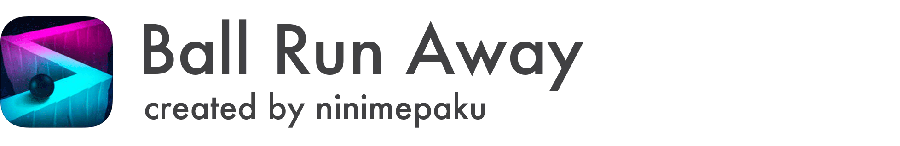

# About BallRunAway

## 概要
- タップでボールを左右に動かし絶壁に落ちないようにコントロールする暇つぶしゲーム
　　　　スコアが高くなるに連れ速度が早くなり、どんどん難しくなる仕組み
## 備考
2年前独学でチュートリアルを見ながら開発していたので大量のSwitch文が目に止まってしまう。。。
## Ball Run Awayダウンロード
-[App Store](https://itunes.apple.com/jp/app/ball-run-away-%E3%83%9C%E3%83%BC%E3%83%AB%E3%82%92%E8%90%BD%E3%81%A8%E3%81%99%E3%81%AA/id1035571683?mt=8)
-[Google Play](https://play.google.com/store/apps/details?id=com.ninimepaku.BallGame&hl=ja)
## スクリーンショット

